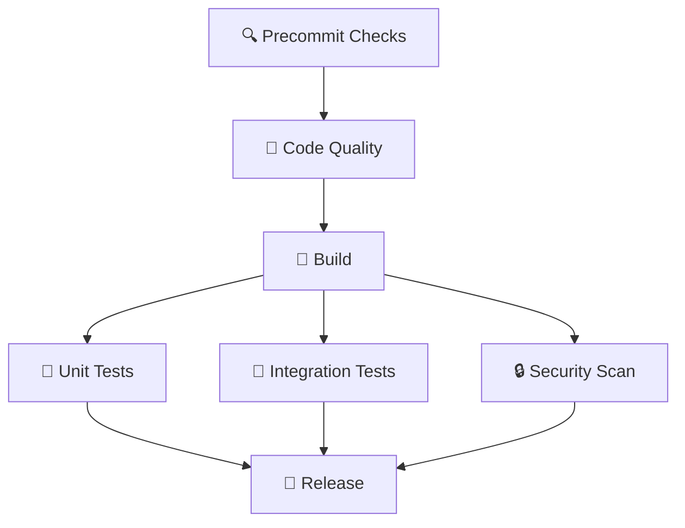

# 🚀 Modern CI/CD Pipeline Documentation

## Übersicht

Diese Dokumentation beschreibt die moderne CI/CD Pipeline basierend auf Industry Best Practices. Die Pipeline implementiert ein vollständiges **Continuous Integration und Continuous Deployment** System für unser FastAPI-Projekt.

## 📊 Pipeline-Architektur



## 🎯 Pipeline-Trigger

### Automatische Ausführung
```yaml
on:
  push:
    branches: [ main, develop ]    # Bei Push auf main/develop
  pull_request:
    branches: [ main, develop ]    # Bei PR gegen main/develop
```

### Manuelle Ausführung
Die Pipeline kann auch manuell über GitHub Actions UI gestartet werden.

---

## 🔧 Umgebungsvariablen

```yaml
env:
  PYTHON_VERSION: "3.11"          # Python-Version für alle Jobs
  COVERAGE_THRESHOLD: 80          # Minimum Coverage-Prozentsatz
```

---

## 📋 Detaillierte Job-Beschreibung

### 1. 🔍 **Precommit Checks**

**Zweck**: Grundlegende Validierung und Umgebungssetup

```yaml
precommit:
  name: 🔍 Precommit Checks
  runs-on: ubuntu-latest
```

#### Schritte:
1. **Repository auschecken**: `actions/checkout@v4`
2. **UV Package Manager installieren**: `astral-sh/setup-uv@v3`
3. **Python 3.11 setup**: `uv python install`
4. **Dependencies installieren**: `uv sync --all-extras --dev`
5. **Branch-Information validieren**: Zeigt aktuelle Branch und PR-Info

#### Was wird getestet:
- ✅ Repository ist korrekt ausgecheckt
- ✅ UV Package Manager funktioniert
- ✅ Python-Installation erfolgreich
- ✅ Alle Dependencies sind installierbar
- ✅ Branch Protection ist aktiv (durch Required Status Checks)

---

### 2. 🧹 **Code Quality (Linting)**

**Zweck**: Code-Qualität und Formatierung prüfen

```yaml
lint:
  needs: [precommit]    # Läuft erst nach erfolgreichem Precommit
```

#### Schritte:
1. **Environment Setup** (wie bei Precommit)
2. **Code Formatting Check**: `ruff format --check .`
3. **Linting**: `ruff check .`
4. **Type Checking**: `mypy src/`

#### Was wird getestet:
- ✅ **Formatierung**: Code ist korrekt formatiert (PEP 8)
- ✅ **Linting**: Keine Code-Smell, unused imports, etc.
- ✅ **Type Safety**: MyPy Type-Checking ohne Fehler
- ✅ **Best Practices**: Ruff prüft 50+ verschiedene Rules

#### Bei Fehlern:
- ❌ Pipeline stoppt sofort
- 💡 Lokale Reparatur: `uv run ruff format .` und `uv run ruff check --fix .`

---

### 3. 🔨 **Build & Compile**

**Zweck**: Docker-Image erstellen und als Artifact speichern

```yaml
build:
  needs: [lint]    # Läuft erst nach erfolgreichem Linting
  outputs:
    image-tag: ${{ steps.meta.outputs.tags }}
    image-digest: ${{ steps.build.outputs.digest }}
```

#### Schritte:
1. **Docker Buildx Setup**: Multi-platform Build-Support
2. **Metadata extrahieren**: Tags und Labels für Image generieren
3. **Docker Image bauen**:
   - **NICHT pushen** (nur für Tests)
   - Als TAR-File nach `/tmp/image.tar` speichern
   - GitHub Actions Cache nutzen für schnellere Builds
4. **Image als Artifact hochladen**: Für andere Jobs verfügbar machen

#### Generated Tags:
```bash
# Beispiele:
ghcr.io/josua/fast:main-a1b2c3d          # Branch + SHA
ghcr.io/josua/fast:pr-123                # Pull Request
ghcr.io/josua/fast:develop-x1y2z3        # Develop Branch
```

#### Was wird getestet:
- ✅ **Dockerfile Syntax**: Keine Syntax-Fehler
- ✅ **Build Process**: Image wird erfolgreich erstellt
- ✅ **Dependencies**: Alle Python-Dependencies installierbar
- ✅ **Image Size**: Optimierte Multi-Stage Build

---

### 4. 🧪 **Unit Tests**

**Zweck**: Anwendungslogik testen mit Coverage-Enforcement

```yaml
unit-tests:
  needs: [build]    # Läuft parallel zu Integration Tests
```

#### Schritte:
1. **Environment Setup**
2. **Unit Tests ausführen**:
   ```bash
   uv run pytest tests/ -v --cov=src --cov-report=xml --cov-report=term
   ```
3. **Coverage Threshold prüfen**:
   ```bash
   uv run coverage report --fail-under=80
   ```
4. **Coverage zu Codecov hochladen**: Für externe Coverage-Tracking

#### Was wird getestet:
- ✅ **Alle Tests erfolgreich**: Pytest Exit Code 0
- ✅ **80%+ Coverage**: Automatic Fail bei weniger Coverage
- ✅ **API Endpoints**: Health, Status, API v1 Endpoints
- ✅ **Business Logic**: Alle Funktionen und Klassen

#### Coverage Report Beispiel:
```
Name                    Stmts   Miss  Cover
-------------------------------------------
src/fast_api/main.py       45      2    96%
src/fast_api/config.py     20      0   100%
src/fast_api/routers/      30      1    97%
-------------------------------------------
TOTAL                      95      3    97%
```

#### Bei Coverage unter 80%:
- ❌ **Pipeline Failed**: Job schlägt fehl
- 💡 **Lösung**: Mehr Tests schreiben oder Test-Coverage verbessern

---

### 5. 🔗 **Integration Tests** (NEU!)

**Zweck**: End-to-End Tests der gebauten Docker-Anwendung

```yaml
integration-tests:
  needs: [build]    # Läuft parallel zu Unit Tests
```

#### Schritte:
1. **Docker Image vom Build-Job herunterladen**
2. **Image laden**: `docker load --input /tmp/image.tar`
3. **Container starten**:
   ```bash
   docker run -d --name test-app -p 8000:8000 $IMAGE_TAG
   ```
4. **Warten bis App bereit**: `sleep 10` (Wait for startup)
5. **HTTP-Endpoints testen**:
   ```bash
   curl -f http://localhost:8000/health       # Health Check
   curl -f http://localhost:8000/health/ready # Readiness Probe
   curl -f http://localhost:8000/health/live  # Liveness Probe
   curl -f http://localhost:8000/api/v1/      # API v1 Root
   ```
6. **Cleanup**: Container stoppen und entfernen

#### Was wird getestet:
- ✅ **Docker Container startet**: Keine Startup-Fehler
- ✅ **Port Binding**: Port 8000 ist erreichbar
- ✅ **Health Endpoints**: Kubernetes-Ready Health Checks
- ✅ **API Verfügbarkeit**: REST API antwortet korrekt
- ✅ **End-to-End Flow**: Kompletter Request-Response-Zyklus

#### Real-World Simulation:
Diese Tests simulieren eine **echte Deployment-Umgebung** und testen:
- Containerized Application
- Network-Verfügbarkeit
- Production-ähnliche Bedingungen

---

### 6. 🔒 **Security Scan**

**Zweck**: Sicherheitslücken in Code und Dependencies finden

```yaml
security:
  needs: [build]    # Läuft parallel zu anderen Tests
```

#### Schritte:
1. **Environment Setup**
2. **Bandit Security Scan**:
   ```bash
   uv run bandit -r src/ -f json -o bandit-report.json
   ```
3. **Security Report hochladen**: Als Artifact für Review

#### Was wird geprüft:
- ✅ **Hardcoded Secrets**: Keine API-Keys im Code
- ✅ **SQL Injection**: Sichere Datenbankabfragen
- ✅ **XSS Vulnerabilities**: Cross-Site-Scripting Prävention
- ✅ **Insecure Dependencies**: Bekannte CVEs in Libraries
- ✅ **Crypto Issues**: Schwache Verschlüsselung
- ✅ **Input Validation**: Unsichere User-Inputs

#### Security Report Beispiel:
```json
{
  "results": [
    {
      "code": "hardcoded_password_string",
      "filename": "src/config.py",
      "issue_severity": "LOW",
      "line_number": 25
    }
  ],
  "metrics": {
    "loc": 245,
    "nosec": 0
  }
}
```

---

### 7. 🚀 **Release** (Production Deployment)

**Zweck**: Production-Ready Deployment (nur bei main branch)

```yaml
release:
  needs: [unit-tests, integration-tests, security]  # Alle Tests müssen erfolgreich sein
  if: github.ref == 'refs/heads/main' && github.event_name == 'push'
  environment: production    # GitHub Environment Protection
```

#### Bedingungen für Release:
- ✅ **Branch**: Nur `main` branch
- ✅ **Event**: Nur bei `push` (nicht bei PRs)
- ✅ **All Tests Passed**: Unit + Integration + Security
- ✅ **Environment Protection**: Manuelle Approval möglich

#### Schritte:
1. **GitHub Container Registry Login**:
   ```bash
   echo $GITHUB_TOKEN | docker login ghcr.io -u $GITHUB_ACTOR --password-stdin
   ```
2. **Docker Image herunterladen**: Wiederverwendung vom Build-Job
3. **Image taggen und pushen**:
   ```bash
   docker tag $IMAGE ghcr.io/josua/fast:latest
   docker tag $IMAGE ghcr.io/josua/fast:$GITHUB_SHA
   docker push ghcr.io/josua/fast:latest     # Latest Release
   docker push ghcr.io/josua/fast:$GITHUB_SHA # Specific Version
   ```
4. **Production Deployment** (aktuell Placeholder):
   ```bash
   # Hier würdest du echte Deployment-Commands einfügen:
   # kubectl set image deployment/app app=ghcr.io/josua/fast:$GITHUB_SHA
   # helm upgrade myapp ./charts/fastapi --set image.tag=$GITHUB_SHA
   # docker-compose -f production.yml up -d
   ```

#### Was wird deployed:
- 📦 **Container Image**: Getaggt und gepusht zu GHCR
- 🏷️ **Versionierung**: SHA-basierte Tags für Rollbacks
- 🔄 **Latest Tag**: Immer aktuellste Version
- 📝 **Deployment Log**: Vollständige Nachverfolgbarkeit

---

## 🎛️ Pipeline-Konfiguration

### Job-Dependencies (Execution Order)

```
1. precommit (Sequenziell)
   ↓
2. lint (Nach precommit)
   ↓
3. build (Nach lint)
   ↓
4. unit-tests + integration-tests + security (Parallel)
   ↓
5. release (Nach allen Tests, nur main branch)
```

### Parallelisierung

**Parallel ausgeführte Jobs** (nach Build):
- 🧪 Unit Tests
- 🔗 Integration Tests
- 🔒 Security Scan

**Vorteile:**
- ⚡ **Schneller**: 3 Jobs parallel statt sequenziell
- 🔄 **Efficient**: Bessere Resource-Nutzung
- 🚫 **Fail Fast**: Schnelles Feedback bei Fehlern

### Artifact-Management

**Docker Image Sharing:**
```
build → artifact (image.tar) → [unit-tests, integration-tests, release]
```

**Vorteile:**
- 📦 **Wiederverwendung**: Image nur einmal bauen
- 💾 **Effizienz**: Weniger Build-Zeit
- 🎯 **Consistency**: Gleiche Image in allen Tests

---

## 📊 Monitoring & Observability

### GitHub Actions Dashboard

**Job Status Übersicht:**
```
✅ 🔍 Precommit Checks     (2m 15s)
✅ 🧹 Code Quality        (1m 45s)
✅ 🔨 Build              (3m 30s)
✅ 🧪 Unit Tests         (2m 20s)
✅ 🔗 Integration Tests  (1m 55s)
✅ 🔒 Security Scan      (1m 10s)
✅ 🚀 Release            (2m 45s)
─────────────────────────────────
Total Runtime: ~6-8 minutes
```

### Coverage Tracking

**Codecov Integration:**
- 📈 **Coverage Trends**: Historische Coverage-Entwicklung
- 🎯 **Coverage Goals**: 80% Minimum, 90%+ Ziel
- 📊 **File-Level Coverage**: Detaillierte Analyse pro File
- 💬 **PR Comments**: Automatische Coverage-Reports in PRs

### Security Monitoring

**Bandit Reports:**
- 🔒 **Security Artifacts**: JSON-Reports für jede Pipeline
- 📋 **Issue Tracking**: Sicherheitslücken dokumentiert
- 🔍 **Trend Analysis**: Sicherheit über Zeit verfolgen

---

## 🛠️ Lokale Entwicklung

### Pre-Pipeline Testing

**Vor einem Push alle Checks lokal ausführen:**

```bash
# 1. Code Quality
uv run ruff format .           # Code formatieren
uv run ruff check .            # Linting
uv run mypy src/              # Type checking

# 2. Tests
uv run pytest --cov=src --cov-report=term    # Unit tests
uv run coverage report --fail-under=80       # Coverage check

# 3. Security
uv run bandit -r src/         # Security scan

# 4. Build Test
docker build -f docker/Dockerfile -t fast-api-test .
docker run -d -p 8000:8000 fast-api-test
curl http://localhost:8000/health           # Integration test
```

### Pre-commit Hooks

**Automatische Checks vor jedem Commit:**
```bash
uv run pre-commit install     # Einmalig installieren
# Dann automatisch bei jedem Commit:
# - trailing-whitespace
# - end-of-file-fixer
# - check-yaml
# - ruff (linting & formatting)
# - mypy (type checking)
```

---

## 🚨 Troubleshooting

### Häufige Pipeline-Fehler

#### 1. **Code Quality Fehler**
```
❌ ruff format --check . failed
```
**Lösung:**
```bash
uv run ruff format .    # Code automatisch formatieren
git add -u && git commit --amend --no-edit
```

#### 2. **Coverage zu niedrig**
```
❌ coverage report --fail-under=80 failed
TOTAL coverage: 75%
```
**Lösung:**
- Mehr Unit Tests schreiben
- Ungetestete Code-Pfade identifizieren
- `uv run coverage html` für detaillierte Analyse

#### 3. **Integration Tests fehlgeschlagen**
```
❌ curl -f http://localhost:8000/health failed
```
**Mögliche Ursachen:**
- Docker Container startet nicht
- Port-Binding Probleme
- Anwendung braucht länger zum Starten

**Debugging:**
```bash
# Lokaler Test:
docker build -f docker/Dockerfile -t debug-image .
docker run -p 8000:8000 debug-image
# In anderem Terminal:
curl -v http://localhost:8000/health
```

#### 4. **Security Scan Issues**
```
❌ High severity security issues found
```
**Lösung:**
- Bandit-Report analysieren
- Sicherheitslücken beheben
- Dependencies aktualisieren

#### 5. **Docker Build fehlgeschlagen**
```
❌ Error: failed to solve: process "/bin/sh -c pip install ..." failed
```
**Häufige Ursachen:**
- Dependencies nicht verfügbar
- Python-Version Konflikte
- Dockerfile-Syntax Fehler

---

## 🔄 Pipeline-Wartung

### Regelmäßige Updates

**Monatlich prüfen:**
- GitHub Actions Versionen (`@v4` → `@v5`)
- Python Version Updates
- UV Package Manager Updates
- Security-Dependencies

**Actions Version Updates:**
```yaml
# Alt:
- uses: actions/checkout@v4
# Neu:
- uses: actions/checkout@v5
```

### Performance Optimierung

**Build-Cache Management:**
```yaml
cache-from: type=gha         # GitHub Actions Cache
cache-to: type=gha,mode=max  # Maximale Cache-Nutzung
```

**Parallelisierung erweitern:**
- Matrix-Builds für mehrere Python-Versionen
- OS-spezifische Tests (Ubuntu, Windows, macOS)
- Dependency-Updates in separaten Jobs

---

## 📈 Metriken & KPIs

### Pipeline-Leistung

**Ziel-Metriken:**
- ⏱️ **Build-Zeit**: < 8 Minuten total
- ✅ **Success Rate**: > 95%
- 🔄 **Cache Hit Rate**: > 80%
- 📊 **Coverage**: > 85% (Ziel: 90%+)

### Qualitäts-Metriken

**Code Quality:**
- 🧹 **Linting Issues**: 0 Fehler
- 🔒 **Security Issues**: 0 High/Critical
- 📝 **Type Coverage**: > 90%
- 🧪 **Test Coverage**: > 80%

---

## 🎯 Best Practices

### Pipeline-Design

1. **✅ Fail Fast**: Schnelle Fehler-Erkennung
2. **⚡ Parallelisierung**: Jobs parallel wo möglich
3. **🔄 Wiederverwendung**: Artifacts zwischen Jobs teilen
4. **📊 Observability**: Detailliertes Logging und Metriken
5. **🔒 Security First**: Security-Checks in jeder Pipeline

### Entwickler-Experience

1. **🚀 Lokale Parity**: Pipeline lokal nachvollziehbar
2. **💬 Klare Feedback**: Aussagekräftige Fehlermeldungen
3. **📚 Dokumentation**: Alle Schritte dokumentiert
4. **🛠️ Easy Debugging**: Troubleshooting-Guides verfügbar

---

## 🔗 Weiterführende Links

- [GitHub Actions Documentation](https://docs.github.com/en/actions)
- [UV Package Manager](https://github.com/astral-sh/uv)
- [Ruff Linter](https://github.com/astral-sh/ruff)
- [Codecov Documentation](https://docs.codecov.io/)
- [Docker Build Best Practices](https://docs.docker.com/develop/dev-best-practices/)
- [Bandit Security Linter](https://bandit.readthedocs.io/)

---

**📝 Letzte Aktualisierung**: $(date)
**👤 Erstellt von**: FastAPI CI/CD Team
**🔄 Version**: 1.0.0
**📊 Pipeline Status**: [](https://github.com/JosiTosi/fast/actions)
